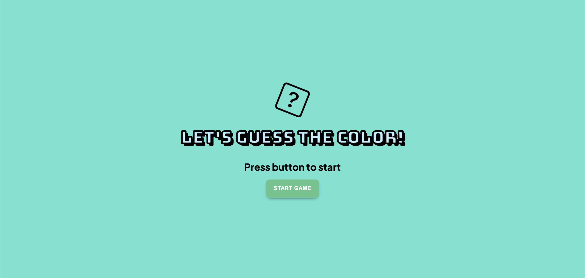

# Color Generator Game

# Overview

Welcome! This projected was created using ReactJS and SCSS/SASS for custom CSS styling. The goal of this project was to further familiarize myself with using React for my projects. I followed a tutorial from Web Dev Cody on Youtube to supplement the completion of this project. I wanted to gain in-depth understanding of using react hooks, such as useState() and useEffect(). I also wanted more practice on creating complex logic to create complex projects projects. This random color generator game was a good project to create as it touched on a lot of areas where a junior level developer should be. 

# Expanding the project

To build on the tutorial, I didn't want to just stop at where the tutorial ended. I realized that tutorials are great foundations in practicing scalability, and refining and expanding on solutions. For this project, I made it feel more like an actual game, instead of just a single pager that loads up and tells the user to guess the color. On top of the tutorial I added:

- a "Start Page" with my own design and styling
- Buttons on both the "Start Page" and "Game Page" to navigate between the components, so the user can go back and forth to the Start and Game pages

# Future Additions

To further this project and the skills I gained finishing this project, I wanted to make this application to where it has one more game. Basically, a game of colors! Where the user can pick between guessing a color and playing a whole different game with different concepts and mechanics, all involving generating random colors. 

# Next Game

The additional game I spoke about will be called "Color Game". It's more of a betting game, but using colors! Simply put, 
- the user will have a 3 x 2 array or board, which will have 6 colors already picked out

- on the outside of the board, there will be 3 blocks or 3 elements of an array, each element will generate a random color when the user clicks a button and generates it

- However, the 3 blocks will each generate a random color relative to the colors on the game board. 

- The user will be able to place bets on the board, on which color they think will show up on the 3 blocks, before generating a random color

- If the randomly generated colors match a bet on the board game, the players earnings will double, if the 3 blocks have 2 of the same colors, and the user matches that color, then their earnings will triple. 

- There will be a "Clear Board" btn where all bets and colors are reset

